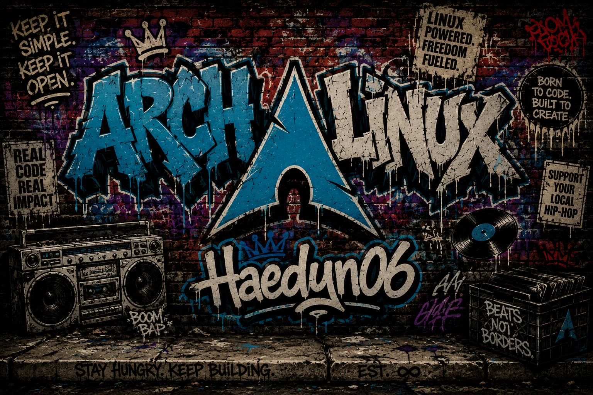

  

    

---

## About Me

I am a specialized developer in different fields such as:
- Full-Stack Development (Web or Mobile)
- Embedded/IoT Development
- Game Development
- Systems Development

I use Arch Linux as my primary OS and development machine. 

I tinker with boards such as Arduino, Raspberry Pi's and other micro controllers and make mini projects out of them.

---

## Top Projects

-  ### [**Motor Hand Controls**](https://github.com/Haedyn06/Motor-Hand-Controls)
-  ### [**Arch Ricing Configs**](https://github.com/Haedyn06/Laptop-Arch-Ricing) 
-  ### [**Drive Logger**](https://github.com/Haedyn06/Drive-Log-Mobile)
-  ### [**Arc Wellness**](https://github.com/Alidawood123/capstone) ([**Visit**](https://apps.apple.com/ca/app/arc-wellness/id6761204779))
-  ### [**Project HomeFull**](https://project-homefull.vercel.app/) ([**Visit**](https://project-homefull.vercel.app/))

---

## Technical Skills

### Languages

  
  
  
  
  
  
  

### Frameworks & Libraries

  
  
  
  
  
  

### Tools & Platforms

  
  
  
  
  
  
  
  
  

---

### Connect on [LinkedIn](https://www.linkedin.com/in/hayden-davac/) or email at [hayden.davingo06@gmail.com](mailto:hayden.davingo06@gmail.com)!
